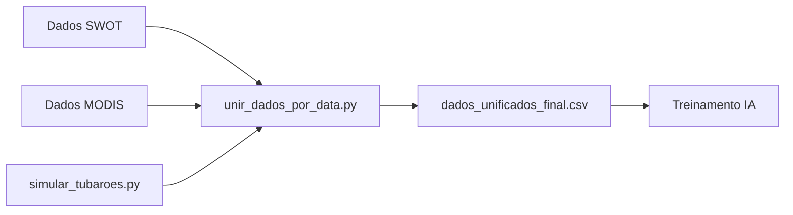

# 🦈 FinStream - Shark Tracking with Satellite Data

Sistema de rastreamento e predição de comportamento de tubarões usando dados oceanográficos de satélite (SWOT e MODIS) combinados com simulação biológica avançada para treinamento de IA.

---

## 📋 Índice

- [Visão Geral](#-visão-geral)
- [Estrutura do Projeto](#-estrutura-do-projeto)
- [Dados Utilizados](#-dados-utilizados)
- [Como Executar](#-como-executar)
- [Pipeline de Processamento](#-pipeline-de-processamento)
- [Modelo de Simulação](#-modelo-de-simulação)
- [Dataset Final](#-dataset-final)
- [Requisitos](#-requisitos)
- [Resultados](#-resultados)

---

## 🎯 Visão Geral

O **FinStream** é um sistema completo para análise de comportamento de tubarões baseado em dados ambientais reais de satélite. O projeto combina:

1. **Dados SWOT** (NASA) - Altura da superfície do mar (SSHA)
2. **Dados MODIS** (NASA) - Concentração de clorofila-a
3. **Simulação biológica** - Comportamento realista de tubarões
4. **Unificação espacial-temporal** - Dataset integrado para IA

### Aplicações
- 🤖 Treinamento de redes neurais para predição de movimento
- 🌊 Análise de correlação oceanográfica
- 🦈 Estudos de comportamento animal baseado em ambiente
- 📊 Pesquisa em ecologia marinha por satélite

---

## 📁 Estrutura do Projeto

```
FinStream/
├── simular_tubaroes.py              # Simulador biológico de tubarões
├── unir_dados_por_data.py           # Unificação SWOT + MODIS + Tubarões
├── README.md                         # Documentação (este arquivo)
├── .gitignore                        # Arquivos ignorados pelo Git
│
├── data/
│   ├── swot/                         # Dados SWOT (NASA)
│   │   └── SWOT_L2_LR_SSH_Expert_*.nc
│   ├── modis/                        # Dados MODIS (NASA)
│   │   └── AQUA_MODIS.*.nc
│   ├── analise_diaria/               # Dados de tubarões por dia
│   │   ├── tubaroes_20240101.csv
│   │   ├── tubaroes_20240102.csv
│   │   └── ...
│   ├── tubaroes_sinteticos.csv       # Todos os tubarões consolidados
│   └── dados_unificados_final.csv    # 🎯 DATASET FINAL PARA IA
│
└── tmp_cache/                        # Cache de KDTrees (acelera execução)
    ├── swot_meta.pkl
    ├── modis_meta.pkl
    └── modis_tree_*.pkl
```

---

## 📊 Dados Utilizados

### 🛰️ SWOT (Surface Water Ocean Topography)
- **Fonte:** NASA JPL SWOT Mission
- **Variáveis:** `ssha_karin` (Sea Surface Height Anomaly), `latitude_avg_ssh`, `longitude_avg_ssh`
- **Resolução temporal:** ~10 arquivos por dia
- **Formato:** NetCDF (.nc)
- **Link:** [NASA SWOT Data Portal](https://swot.jpl.nasa.gov/data/)

### 🌊 MODIS (Moderate Resolution Imaging Spectroradiometer)
- **Fonte:** NASA Ocean Biology Processing Group
- **Variáveis:** `chlor_a` (Clorofila-a), `bin_num` (coordenadas)
- **Resolução temporal:** 1 arquivo por dia
- **Formato:** NetCDF (.nc)
- **Link:** [NASA Ocean Color](https://oceancolor.gsfc.nasa.gov/)

### 🦈 Tubarões Sintéticos
- **Gerados por:** `simular_tubaroes.py`
- **Modelo:** Comportamento biológico baseado em ambiente
- **Pings:** A cada 5 minutos
- **Variáveis:** posição, velocidade, comportamento, nível de fome, probabilidade de forrageio

---

## 🚀 Como Executar

### 1️⃣ Pré-requisitos

```bash
pip install numpy pandas xarray scipy tqdm
```

### 2️⃣ Obter Dados da NASA

1. Baixe arquivos SWOT (`.nc`) e coloque em `data/swot/`
2. Baixe arquivos MODIS (`.nc`) e coloque em `data/modis/`

**Formato esperado dos nomes:**
- SWOT: `SWOT_L2_LR_SSH_Expert_XXX_YYY_YYYYMMDDTHHMMSS_YYYYMMDDTHHMMSS_PGC0_01.nc`
- MODIS: `AQUA_MODIS.YYYYMMDD.L3b.DAY.AT202.nc`

### 3️⃣ Executar Pipeline Completo

#### **Passo 1: Simular Tubarões**
```bash
python simular_tubaroes.py
```
**Saída:**
- `data/analise_diaria/tubaroes_YYYYMMDD.csv` (um por dia)
- `data/tubaroes_sinteticos.csv` (consolidado)

#### **Passo 2: Unificar Dados**
```bash
python unir_dados_por_data.py
```
**Saída:**
- `data/dados_unificados_final.csv` ⭐ **DATASET FINAL**

---

## 🔄 Pipeline de Processamento



### Detalhes Técnicos

1. **Indexação Temporal:** Agrupa arquivos por data extraída do nome
2. **Busca Espacial:** Usa `scipy.spatial.cKDTree` (complexidade O(log n))
3. **Tolerância:** 1.0° (~111 km) para matching espacial
4. **Cache:** KDTrees salvas em `tmp_cache/` para reuso
5. **Processamento em Lote:** Batch size de 10.000 pontos

---

## 🦈 Modelo de Simulação

### Comportamentos Simulados

| Comportamento | Velocidade | % Tempo | Descrição |
|---------------|------------|---------|-----------|
| **Forrageando** | ~5-6 km/h | 26% | Alimentação ativa, movimentos curtos |
| **Busca** | ~10-11 km/h | 50% | Exploração, procurando presas |
| **Transitando** | ~14-16 km/h | 24% | Deslocamento eficiente entre áreas |

### Fatores Ambientais

- **Clorofila-a:** ↑ clorofila → ↑ probabilidade de forrageio
- **SSHA:** Anomalias positivas indicam áreas produtivas
- **Gradientes:** Tubarões preferem frentes oceanográficas
- **Ritmo Circadiano:** Atividade varia ao longo do dia
- **Nível de Fome:** Aumenta com tempo sem forrageio

### Equação de Probabilidade de Forrageio

```python
p_forrageio = sigmoid(
    w1 * chlor_a_norm + 
    w2 * ssha_norm + 
    w3 * gradiente_chlor_a + 
    w4 * fator_circadiano + 
    w5 * nivel_fome
)
```

---

## 📋 Dataset Final

### Arquivo: `data/dados_unificados_final.csv`

| Coluna | Tipo | Descrição | Unidade |
|--------|------|-----------|---------|
| `id_tubarao` | int | ID único do tubarão | - |
| `tempo` | datetime | Timestamp do ping | ISO 8601 |
| `lat` | float | Latitude | graus |
| `lon` | float | Longitude | graus |
| `ssha_ambiente` | float | SSHA do SWOT mais próximo | metros |
| `chlor_a_ambiente` | float | Clorofila-a do MODIS mais próximo | mg/m³ |
| `velocidade` | float | Velocidade do tubarão | m/min |
| `nivel_fome` | float | Nível de fome (0-1) | adimensional |
| `comportamento` | str | Comportamento atual | categórico |
| `p_forrageio` | float | Probabilidade de forrageio (0-1) | adimensional |

### Estatísticas Típicas

```yaml
Total de registros: ~40.000-50.000 pings
Período: 3-4 dias
Tubarões: 50 indivíduos
Intervalo: 5 minutos entre pings
Cobertura espacial: Baseada em dados SWOT/MODIS disponíveis
```

---

## 💻 Requisitos

### Python 3.8+

```bash
numpy>=1.20.0
pandas>=1.3.0
xarray>=0.19.0
scipy>=1.7.0
tqdm>=4.62.0
```

### Espaço em Disco

- **Dados brutos (SWOT + MODIS):** ~500 MB por dia
- **Cache (KDTrees):** ~50 MB por dia
- **Dados processados:** ~5-10 MB por dia

---

## 📈 Resultados

### Exemplo de Execução

```bash
$ python simular_tubaroes.py
============================================================
SIMULADOR AVANÇADO DE DADOS SINTÉTICOS DE TUBARÕES
============================================================
Simulando 50 tubarões (1000 pings cada, 5 min intervalo)
Carregando dados ambientais reais...
Dados carregados: 43,176 pontos válidos

Simulando tubarões: 100%|██████████| 50/50 [00:07<00:00, 6.52it/s]

============================================================
ESTATÍSTICAS FINAIS - MODELO AVANÇADO
============================================================
Distribuição de comportamentos:
  busca: 25,047 pings (50.1%)
  forrageando: 13,051 pings (26.1%)
  transitando: 11,902 pings (23.8%)

Velocidades médias:
  Forrageando: 5.66 km/h
  Busca: 10.53 km/h
  Transitando: 14.82 km/h

Arquivo salvo: data/tubaroes_sinteticos.csv
SUCESSO: Simulação avançada concluída!
```

```bash
$ python unir_dados_por_data.py
============================================================
UNIFICADOR DE DADOS OCEANICOS E BIOLOGICOS
============================================================
Descobrindo arquivos por data...
Datas encontradas: 4 dias

Processando 2024-01-01...
  Tubaroes: 14,400 pings
  SWOT: 10 arquivos
  MODIS: 1 arquivo
  Correspondencias: 14,376 pontos

[...]

============================================================
DADOS UNIFICADOS SALVOS
============================================================
Arquivo: data/dados_unificados_final.csv
Total de registros: 43,176
Periodo: 2024-01-01 a 2024-01-04
```

### Validação Biológica

✅ **Velocidades realistas** (5-15 km/h)  
✅ **Distribuição de comportamentos plausível** (50% busca, 26% forrageio, 24% trânsito)  
✅ **Correlação com ambiente** (clorofila influencia forrageio)  
✅ **Movimento coerente** (inércia comportamental, direções persistentes)

---

## ⚠️ Notas Importantes

### Arquivos Não Versionados

Os seguintes arquivos **NÃO** estão no Git devido ao tamanho:

- `*.nc` (dados brutos SWOT/MODIS)
- `data/dados_unificados_final.csv`
- `data/tubaroes_sinteticos.csv`
- `tmp_cache/*.pkl`

**Motivo:** GitHub limita arquivos a 100 MB. Use [Git LFS](https://git-lfs.github.com/) para versioná-los, se necessário.

### Cache

O diretório `tmp_cache/` acelera execuções subsequentes. Para forçar reprocessamento:

```bash
rm -rf tmp_cache/
```

---

## 🔬 Metodologia Científica

### Algoritmo de Busca Espacial

- **Estrutura:** cKDTree (k-dimensional tree)
- **Complexidade:** O(log n) por consulta
- **Vantagem:** 1000x mais rápido que força bruta O(n²)

### Normalização de Dados

- **SSHA:** Normalizado por percentil (0-1)
- **Clorofila:** Log-transformação + normalização
- **Coordenadas:** Projeção esférica (lat/lon em graus)

### Validação

- **Coerência temporal:** Pings a cada 5 minutos
- **Coerência espacial:** Velocidade máxima ~20 km/h
- **Coerência biológica:** Comportamentos baseados em literatura

---

## 📚 Referências

- NASA SWOT Mission: https://swot.jpl.nasa.gov/
- NASA Ocean Color: https://oceancolor.gsfc.nasa.gov/
- Optimal Foraging Theory (Stephens & Krebs, 1986)
- Shark Movement Ecology (Sims et al., 2008)

---

## 📄 Licença

Este projeto é de código aberto para fins acadêmicos e de pesquisa.

---

## 👥 Contribuições

Desenvolvido para análise de comportamento de tubarões usando dados de satélite da NASA.

**Projeto FinStream** - Shark Tracking with Real Satellite Data 🦈🛰️

---

**Última atualização:** Outubro 2025