# 🦈 FinShark - Advanced Shark Tracking with NASA Satellite Data

A comprehensive system for shark behavior prediction using real NASA satellite data (SWOT and MODIS) combined with advanced biological simulation for AI training, validation, and real-time monitoring.

---

## 📚 Complete Documentation

**👉 For comprehensive documentation, visit the [docs/](docs/) directory**

### Quick Navigation:
- **[📖 Complete Documentation](docs/README.md)** - Full documentation index
- **[🎯 System Overview](docs/SYSTEM_OVERVIEW.md)** - Complete system architecture
- **[🚀 Setup Guide](docs/SETUP_INSTALLATION.md)** - Installation and configuration
- **[📡 API Documentation](docs/API_DOCUMENTATION.md)** - Backend API reference
- **[📊 Data Models & Integration](docs/DATA_MODELS_API.md)** - Data structures and API integration
- **[🔄 Real-time Monitoring (TAG)](docs/TAG_SYSTEM.md)** - Real-time monitoring system

---

## 🎯 Project Overview

**FinShark** integrates three major components:

1. **🐍 Python Data Processing Pipeline**
   - Real NASA satellite data processing (SWOT + MODIS)
   - Advanced shark behavior simulation
   - AI model training and inference
   - Spatial-temporal data unification

2. **🏗️ .NET Backend API**
   - RESTful API for data management
   - PostgreSQL database integration
   - Real-time data ingestion
   - Historical data aggregation

3. **📡 Real-time Monitoring (TAG System)**
   - Continuous shark tracking simulation
   - Environmental data integration
   - AI-powered behavioral prediction
   - API-based data streaming

---

## 🏗️ System Architecture

```mermaid
graph TB
    subgraph "🌊 Environmental Data Sources"
        SWOT[SWOT Satellite Data<br/>Sea Surface Height Anomaly]
        MODIS[MODIS Satellite Data<br/>Chlorophyll-a Concentration]
    end
    
    subgraph "🐍 Python Data Processing Pipeline"
        SIM[Shark Simulation<br/>simular_tubaroes.py]
        UNIFY[Data Unification<br/>unir_dados_por_data.py]
        AI[AI Training & Inference<br/>tutuba.py + inferencia.py]
    end
    
    subgraph "🏗️ .NET Backend API"
        API[REST API<br/>Controllers & Services]
        DB[(PostgreSQL<br/>Database)]
        AGG[Data Aggregation<br/>Historical Analysis]
    end
    
    subgraph "📡 Real-time Monitoring (TAG)"
        TAG[Real-time Agent<br/>server_IA.py]
        MONITOR[Continuous Processing<br/>1-minute intervals]
    end
    
    SWOT --> SIM
    MODIS --> SIM
    SIM --> UNIFY
    UNIFY --> AI
    AI --> TAG
    TAG --> API
    API --> DB
    DB --> AGG
```



---

## 🚀 Quick Start

### 1. Prerequisites
- **Python 3.8+** with scientific libraries
- **.NET 9.0 SDK**
- **PostgreSQL 13+** with PostGIS
- **NASA satellite data** (SWOT and MODIS)

### 2. Installation
```bash
# Clone repository
git clone <repository-url>
cd FinStream

# Setup Python environment
python -m venv finshark_env
source finshark_env/bin/activate  # Linux/macOS
pip install numpy pandas xarray scipy tensorflow scikit-learn requests

# Setup .NET backend
cd Nasa-Backend
dotnet restore
dotnet build

# Setup database
# Create PostgreSQL database and run schema scripts
```

### 3. Run Complete Pipeline
```bash
# 1. Generate shark simulation data
python simular_tubaroes.py

# 2. Unify with environmental data
python unir_dados_por_data.py

# 3. Train AI model
python data/IA/tutuba.py

# 4. Deploy models to TAG system
cp data/IA/IA_TREINADA/* TAG/IA/Model/

# 5. Generate TAG data
cd TAG/Data/data_tag_fake && python simular_tubaroes_tag.py

# 6. Start backend API
cd Nasa-Backend && dotnet run --project src/Nasa.API/

# 7. Start real-time monitoring
cd TAG/IA/agent && python server_IA.py
```

---

## 📊 Key Features

### 🦈 Shark Behavior Analysis
- **Realistic Simulation**: Biologically-based movement and behavior modeling
- **Environmental Correlation**: Integration with NASA satellite data
- **Behavior Classification**: Search, Forage, Transit behaviors
- **Telemetry Data**: Complete sensor simulation (GPS, depth, temperature, accelerometer, gyroscope)

### 🤖 AI & Machine Learning
- **Multi-output Neural Network**: Behavior classification + foraging probability
- **Real-time Inference**: <1ms prediction time
- **High Accuracy**: 85-90% behavior classification accuracy
- **Environmental Integration**: Uses SWOT and MODIS data for predictions

### 🌊 Environmental Data Processing
- **SWOT Integration**: Sea Surface Height Anomaly processing
- **MODIS Integration**: Chlorophyll-a concentration analysis
- **Spatial Unification**: KDTree-based efficient spatial matching
- **Real-time Updates**: Continuous environmental data integration

### 📡 Real-time Monitoring
- **Continuous Processing**: 1-minute interval processing cycles
- **API Integration**: HTTP communication with .NET backend
- **Data Streaming**: Real-time shark tracking data
- **Environmental Updates**: Live environmental data correlation

### 🏗️ Backend Services
- **RESTful API**: Complete CRUD operations
- **Database Integration**: PostgreSQL with spatial indexing
- **Data Aggregation**: Historical analysis and reporting
- **Scalable Architecture**: Microservices-ready design

---

## 📁 Project Structure

```
FinStream/
├── docs/                           # 📚 Complete Documentation
│   ├── README.md                   # Documentation index
│   ├── SYSTEM_OVERVIEW.md          # System overview
│   ├── SETUP_INSTALLATION.md       # Setup guide
│   ├── API_DOCUMENTATION.md        # API reference
│   ├── DATA_MODELS_API.md          # Data structures
│   └── TAG_SYSTEM.md               # Real-time monitoring
│
├── Python Components/              # 🐍 Data Processing Pipeline
│   ├── simular_tubaroes.py         # Shark behavior simulator
│   ├── unir_dados_por_data.py      # Data unification
│   ├── data/IA/                    # AI training and inference
│   └── TAG/                        # Real-time monitoring system
│
├── Nasa-Backend/                   # 🏗️ .NET Backend API
│   ├── src/Nasa.API/               # REST API controllers
│   ├── src/Nasa.Domain/            # Domain models
│   ├── src/Nasa.Data/              # Data access layer
│   └── docs/                       # Backend documentation
│
└── README.md                       # This file
```

---

## 🔄 Data Flow

### 1. Data Acquisition & Processing
- NASA satellite data (SWOT + MODIS) → Python processing
- Shark behavior simulation → Telemetry data generation
- Spatial-temporal unification → AI training dataset

### 2. AI Training & Model Development
- Feature engineering → Neural network training
- Model validation → Performance metrics
- Model deployment → Real-time inference system

### 3. Real-time Monitoring & API Integration
- Continuous processing → Environmental data integration
- AI inference → Behavioral predictions
- API transmission → .NET backend storage

### 4. Backend Processing & Storage
- Data ingestion → Validation and storage
- Database operations → Historical aggregation
- API responses → Data access and querying

---

## 🎯 Use Cases

### Marine Ecology Research
- Study shark movement patterns in relation to oceanographic features
- Analyze foraging behavior in different environmental conditions
- Research pelagic shark ecology using satellite data

### Conservation Applications
- Monitor shark populations in real-time
- Identify critical habitat areas
- Support marine protected area management

### Educational Applications
- Demonstrate satellite data processing
- Showcase AI applications in marine science
- Provide hands-on experience with real NASA data

---

## 📊 Technical Specifications

### Python Environment
- **Core Libraries**: numpy, pandas, xarray, scipy, tensorflow
- **Performance**: KDTree optimization, batch processing, caching
- **Data Formats**: NetCDF, CSV, JSON

### .NET Environment
- **Framework**: .NET 9.0
- **Database**: PostgreSQL with Dapper ORM
- **API**: ASP.NET Core with Swagger documentation
- **Security**: IP whitelisting, CORS configuration

### Integration
- **Communication**: HTTP REST API
- **Data Format**: JSON with standardized schema
- **Real-time**: Continuous data streaming
- **Error Handling**: Comprehensive validation and logging

---

## 🚨 Important Notes

### Model Deployment
**Critical**: After training the AI model, you must manually copy the trained files to the TAG system:
```bash
cp data/IA/IA_TREINADA/tubarao_comportamento_model.h5 TAG/IA/Model/
cp data/IA/IA_TREINADA/scaler.pkl TAG/IA/Model/
```

### File Management
Large files are not versioned in Git due to size limitations:
- `*.nc` (raw SWOT/MODIS data)
- `data/dados_unificados_final.csv`
- `data/IA/IA_TREINADA/*.h5` (trained models)
- `tmp_cache/*.pkl` (performance cache)

### Performance Requirements
- **Memory**: 8GB+ RAM recommended
- **Storage**: 10GB+ free space
- **Network**: Internet connection for NASA data
- **Processing**: Multi-core CPU recommended

---

## 🔗 API Endpoints

### Shark Tracking
- `GET /api/RastreamentoTubaroes/v1/` - List tracking data
- `POST /api/RastreamentoTubaroes/v1/` - Insert new data
- `GET /api/RastreamentoTubaroes/v1/latest-positions` - Get latest positions

### System Information
- `GET /api/info/v1` - System health and information

### Swagger Documentation
- **Development**: `http://localhost:5013/swagger`
- **Interactive Testing**: Test endpoints directly from browser

---

## 📚 Scientific Methodology

### Environmental Data Integration
- **SWOT**: Sea Surface Height Anomaly for oceanographic features
- **MODIS**: Chlorophyll-a for primary productivity indication
- **Spatial Matching**: KDTree-based efficient nearest-neighbor search

### AI Model Architecture
- **Multi-output Neural Network**: Behavior classification + foraging regression
- **Input Features**: 8 features (telemetry + environmental data)
- **Performance**: 85-90% accuracy, R² = 0.7-0.8 for foraging prediction

### Validation Framework
- **Biological Coherence**: Literature-based behavior modeling
- **Environmental Correlation**: Statistical significance testing
- **Data Integrity**: CRC-16/CCITT validation
- **Cross-validation**: Stratified sampling for model evaluation

---

## 🎯 Next Steps

1. **Read the [Complete Documentation](docs/README.md)** for detailed information
2. **Follow the [Setup Guide](docs/SETUP_INSTALLATION.md)** for installation
3. **Explore the [API Documentation](docs/API_DOCUMENTATION.md)** for integration
4. **Check the [TAG System Guide](docs/TAG_SYSTEM.md)** for real-time monitoring

---

## 📄 License

This project is developed for academic and research purposes as part of the NASA competition.

---

## 👥 Contributing

Developed for shark behavior analysis using NASA satellite data.

**FinShark Project** - Advanced Shark Tracking with Real Satellite Data 🦈🛰️

---

**Last Updated:** January 2025  
**Version:** 4.0 - Complete Documentation Suite with .NET Backend Integration